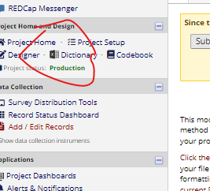
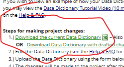

# Supported Input Formats

In this section, supported formats for generating heal-compliant data dictionaries are listed. We also provide additional instructions on how to get the necessary input files format/software.

## Redcap: Data Dictionary CSV Export

For users collecting data in a [Redcap](https://www.project-redcap.org) data management system, HEAL-compliant data dictionaries can be generated directly from Redcap exports. 

The redcap data dictionary export serves the purpose of providing variable level metadata in a standardized,tabular format and is generally easy to export. The HEAL data utilities leverages this user experience and standardized format to enable HEAL researchers to generate a Heal-compliant data dictionary. 

### Export your Redcap data dictionary 

To download a Redcap CSV export do the following*: 

1. After logging in to your Redcap project page, locate the `Data dictionary` page. A link to this page may be available on the project side bar (see image below) or in the `Project Setup tab` at the top of your page.

2. After arriving at the `Data dictionary` page, click on `Download the current data dictionary` to export the dictionary (see below).

*there may be slight differences depending on your specific Redcap instance and version

### Run the `vlmd` command

**TODO: add vlmd command call **

## SAS `sas7bdat` and `sas7bcat` files

To accomodate SAS users, HEAL data utilities supports the binary `Sas7bdat` file format, which contains the actual data values (observations/records). This file also includes variable metadata (variable `names` and variable labels/ `descriptions`).

HEAL data utilities also provides the option to accompany the `sas7bdat` file with a file of another format -- the `Sas7bcat` file.  This type of file contains variable value labels, or `encodings` that can be mapped onto datasets. 

### Creating a `sas7bdat` and a `sas7bcat` file

Many SAS users create formats and labels in their current workflows. In this section, we provide syntax that can be easily copy-pasted into these existing workflows to create `sas7bdat` and `sas7bcat` files to input easily into the `vlmd` tool. To see this template [click here](sas/template.md). And, for an example implementation of this template, [click here](sas/example.md).

### Run the `vlmd` command

After creating the necessary `sas7bdat` and `sas7bcat` files, you can then run the `vlmd` command. Note, the `sas7bcat` files are optional. However, if you don't include, the `encodings` (ie value labels) will not be added.

TODO: ADD VLMD COMMAND HERE

## SPSS `.sav` files

For SPSS users, HEAL data utilities generates heal-compliant data dictioanries from SPSS's default file format for storing datasets: A `SAV` file. It not only stores the data itself but also stores metadata such as variable names, variable labels, types, and value labels. The HEAL data utilities extracts the data and metadata to create heal-compliant data dictionaries.

<!-- ### Creating a well-annotated `sav` file

TO ADD -->

### Run the `vlmd` command

TODO: ADD COMMAND HERE

## Stata `.dta` files

For Stata users, HEAL data utilities generates heal-compliant data dictionaries through Stata's default file format: the `DTA` files. `DTA` files not only store the data itself but also stores metadata such as variable names, variable labels, types, and value labels.

<!-- ### Creating a well-annotated `dta` file

TO ADD -->

## `csv` Datasets

## HEAL data dictionary template